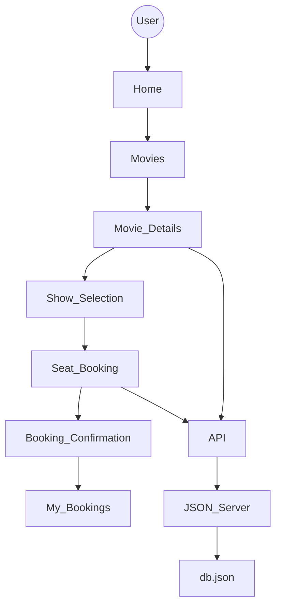
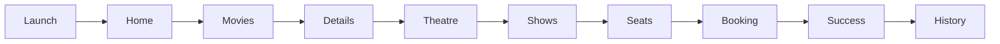
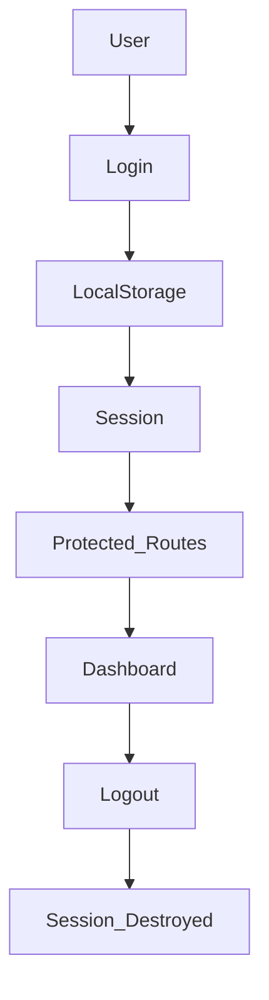
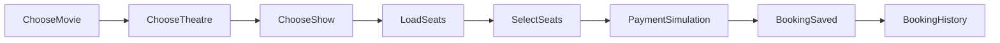
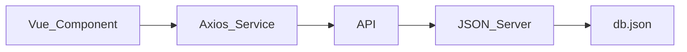

<div align="center">

# 🎬 CineVault

### ✨ Premium Movie Ticket Booking Experience Built with Vue 3


<br>


<br><br>


---
## 📸 Application Preview

<p align="center">


</p>

> Replace screenshots after deployment.

---

# 🎞 About CineVault

CineVault is a modern **Premium Movie Ticket Booking Platform** inspired by India's leading cinema chains such as **PVR** and **INOX**.

It provides users with an immersive booking experience including:

🎬 Movie Discovery

🏢 Theatre Selection

🪑 Interactive Seat Booking

🎟 Booking Management

👤 User Authentication

⚡ Responsive UI

🌙 Premium Dark Theme

Unlike traditional CRUD applications, CineVault focuses heavily on creating a premium user experience with smooth navigation, cinematic visuals, and realistic booking workflows.

---

# ✨ Highlights

<table>

<tr>

<td width="50%">

## 🎥 Movie Catalogue

✔ 58+ Movies

✔ Coming Soon

✔ Now Showing

✔ Movie Details

✔ Cast Information

✔ Trailer Integration

✔ Genre Filtering

✔ Search

</td>

<td width="50%">

## 🎟 Booking System

✔ Interactive Seats

✔ Dynamic Pricing

✔ Theatre Selection

✔ Show Timing

✔ Live Seat Status

✔ Booking History

✔ Instant Confirmation

</td>

</tr>

<tr>

<td>

## 👤 User System

✔ Register

✔ Login

✔ Persistent Session

✔ Logout

✔ Profile

✔ Booking History

</td>

<td>

## 🎨 UI

✔ Responsive

✔ Glassmorphism

✔ Smooth Animation

✔ Gradient Backgrounds

✔ Modern Cards

✔ Premium Typography

</td>

</tr>

</table>

---

# 🚀 Features

## 🎬 Movies

- Browse Movies
- Search Movies
- Genre Filters
- Language Filters
- Movie Details
- Ratings
- Cast Information
- Trailers
- Duration
- Certificate
- Pricing

---

## 🏢 Theatre

- Multiple Cities

- Theatre Selection

- Show Timings

- Available Shows

- Pricing

---

## 💺 Seat Booking

🟢 Available

🔴 Booked

🔵 Selected

✔ Real Time Seat Availability

✔ Premium Layout

✔ Dynamic Booking

✔ Seat Validation

---

## 👤 Authentication

✔ Register

✔ Login

✔ Logout

✔ Session Management

✔ Route Protection

✔ LocalStorage

---

## 📱 Responsive

Desktop

Laptop

Tablet

Mobile

Ultra Wide

---

# ⭐ Why CineVault?

Unlike basic Vue CRUD projects, CineVault simulates a complete cinema ecosystem.

It demonstrates

- Vue Router
- Component Architecture
- REST API Integration
- Axios
- LocalStorage Authentication
- Dynamic Routing
- API Abstraction
- Responsive UI
- Seat Booking Logic
- Production Folder Structure

making it an excellent portfolio project for frontend developers.

---

# 🛠 Tech Stack

<div align="center">

| Frontend | Backend | API | Routing | Authentication | Build Tool |
|-----------|----------|-----|----------|----------------|------------|
|  |  |  |  |  |  |

</div>

---

# ⚙ Core Technologies

| Technology | Purpose |
|------------|----------|
| Vue 3 Composition API | Reactive Frontend Framework |
| Vue Router 4 | Client-side Routing |
| Axios | API Communication |
| JSON Server | Mock REST Backend |
| LocalStorage | Authentication & Session |
| Vite | Lightning Fast Build Tool |
| CSS Variables | Theme & Design Tokens |

---

# 🏗 System Architecture



---

# 🧩 Application Flow



---

# 🔐 Authentication Flow



---

# 💺 Seat Booking Workflow



---

# 📡 API Architecture



---

# 🗄 Database Structure

```text

db.json

│

├── users

├── movies

├── theatres

├── shows

├── seats

└── bookings

```

---

# 📂 Project Structure

```text

CineVault/

│

├── public/

│

├── src/

│   │

│   ├── assets/

│   │

│   ├── components/

│   │      ├── layout/

│   │      ├── movies/

│   │      ├── booking/

│   │      ├── common/

│   │

│   ├── composables/

│   │      ├── useMovies.js

│   │      ├── useBookings.js

│   │

│   ├── services/

│   │      ├── api.js

│   │      ├── auth.js

│   │

│   ├── router/

│   │      └── index.js

│   │

│   ├── pages/

│   │      ├── Home.vue

│   │      ├── Movies.vue

│   │      ├── MovieDetails.vue

│   │      ├── Booking.vue

│   │      ├── MyBookings.vue

│   │      ├── Profile.vue

│   │      ├── FAQ.vue

│   │      ├── Contact.vue

│   │      ├── Privacy.vue

│   │      └── Terms.vue

│   │

│   ├── App.vue

│   └── main.js

│

├── db.json

├── vite.config.js

├── package.json

├── README.md

└── .gitignore

```

---

# 📦 Folder Responsibilities

| Folder | Description |
|----------|-------------|
| assets | Images, Icons, Static Files |
| components | Reusable Vue Components |
| composables | Business Logic & Reusable Hooks |
| pages | Application Pages |
| services | Axios API Layer & Authentication |
| router | Application Routes |
| public | Public Assets |
| db.json | Mock Database |

---

# 🎨 Design Philosophy

### 🎬 Cinema Inspired

Dark Premium Theme

Gradient Accents

Glassmorphism UI

Rounded Components

Premium Cards

Interactive Buttons

Smooth Hover Effects

Modern Typography

Minimal Design

Elegant Shadows

---

# 🎯 Design Goals

✅ Fast

✅ Responsive

✅ Scalable

✅ Modular

✅ Accessible

✅ Easy to Maintain

✅ Production Ready

---

# 📈 Project Statistics

| Metric | Value |
|---------|-------|
| Movies | 58+ |
| Shows | 100+ |
| Theatres | 6 |
| Cities | Multiple |
| Pages | 10+ |
| Components | 25+ |
| API Endpoints | REST Based |
| Authentication | LocalStorage |
| Responsive | Yes |
| Mobile Friendly | 100% |

---

# 🌟 Key Highlights

✨ PVR Inspired Interface

🎬 Premium Movie Experience

⚡ Lightning Fast Navigation

💺 Interactive Seat Selection

🎟 Realistic Booking Flow

🏢 Multi Theatre Support

🎨 Beautiful UI Components

📱 Fully Responsive Design

🧩 Modular Vue Architecture

🚀 Deployment Ready

---

# 🖥 Compatibility

| Platform | Supported |
|-----------|-----------|
| Windows | ✅ |
| Linux | ✅ |
| macOS | ✅ |
| Chrome | ✅ |
| Edge | ✅ |
| Firefox | ✅ |
| Brave | ✅ |
| Safari | ✅ |

---

# 🚀 Getting Started

Follow the steps below to set up CineVault locally for development.

---

# 📋 Prerequisites

Before starting, make sure the following software is installed.

| Software | Version |
|-----------|----------|
| Node.js | >=18 |
| npm | >=9 |
| Git | Latest |
| VS Code | Recommended |

Verify installation

```bash
node -v
npm -v
git --version
```

---

# 📥 Clone Repository

```bash
git clone https://github.com/YOUR_USERNAME/CineVault.git

cd CineVault
```

---

# 📦 Install Dependencies

```bash
npm install
```

---

# 🔐 Environment Variables

Create a `.env` file inside the root directory.

```env
VITE_API_BASE_URL=http://localhost:3000
```

---

# 🗂 Project Setup

```
CineVault/

│

├── src/

├── public/

├── db.json

├── package.json

├── vite.config.js

└── .env

```

---

# ▶ Start JSON Server

Open Terminal 1

```bash
npm run server
```

Server

```
http://localhost:3000
```

---

# ▶ Start Vue Application

Open another terminal

```bash
npm run dev
```

Application

```
http://localhost:5000
```

---

# 🌐 Available Scripts

| Command | Description |
|-----------|-------------|
| npm run dev | Starts Vue Development Server |
| npm run build | Builds Production Version |
| npm run preview | Preview Production Build |
| npm run server | Starts JSON Server |

---

# 📡 REST API Endpoints

## Movies

```http
GET /api/movies
```

Get all movies

---

```http
GET /api/movies/:id
```

Movie Details

---

## Shows

```http
GET /api/shows
```

---

```http
GET /api/shows?movieId=1
```

---

## Theatres

```http
GET /api/theatres
```

---

## Seats

```http
GET /api/seats?showId=5
```

---

## Bookings

```http
GET /api/bookings
```

```http
POST /api/bookings
```

```http
DELETE /api/bookings/:id
```

---

# 📡 API Layer

```
Vue Component

↓

Composable

↓

API Service

↓

Axios

↓

/api

↓

JSON Server

↓

db.json
```

---

# 🗃 Database Collections

```
users

movies

shows

theatres

bookings

seats
```

---

# 💺 Seat Layout

```
SCREEN

────────────────────────

P P P P P P P P P P

N N N N N N N N N N

M M M M M M M M M M

L L L L L L L L L L

──────── PRIME ───────

K K K K K K K K K K

J J J J J J J J J J

H H H H H H H H H H

──── PICTURE PERFECT ──

G G G G G G G G G G

F F F F F F F F F F

E E E E E E E E E E

D D D D D D D D D D

C C C C C C C C C C

B B B B B B B B B B

A A A A A A A A A A

──────── CLASSIC ──────
```

Legend

🟢 Available

🔴 Booked

🔵 Selected

---

# 🎟 Booking Process

```text
Home

↓

Movies

↓

Movie Details

↓

Select Theatre

↓

Select Show

↓

Seat Selection

↓

Booking Summary

↓

Confirmation

↓

My Bookings
```

---

# 🔐 Authentication

```
User Login

↓

Credentials Validation

↓

LocalStorage Session

↓

Protected Routes

↓

Application Access

↓

Logout

↓

Session Cleared
```

---

# 🧠 Local Storage

Stored Keys

```text
cinevault_user

cinevault_session

cinevault_bookings

cinevault_rentals
```

---

# 📸 Screenshots

## 🏠 Home

```md
assets/screenshots/home.png
```

---

## 🎬 Movies

```md
assets/screenshots/movies.png
```

---

## 🎥 Movie Details

```md
assets/screenshots/details.png
```

---

## 💺 Seat Booking

```md
assets/screenshots/booking.png
```

---

## 🎟 Booking Confirmation

```md
assets/screenshots/confirmation.png
```

---

## 👤 Profile

```md
assets/screenshots/profile.png
```

---

# 🎥 GIF Demo

You can upload a recording and display it here.

```html
<p align="center">


</p>
```

---

# 🚀 Deployment

## Build

```bash
npm run build
```

Output

```
dist/
```

---

## Deploy to Vercel

```bash
npm install -g vercel

vercel
```

---

## Deploy to Netlify

```bash
npm run build
```

Upload the `dist` folder.

---

## Deploy Backend

Run JSON Server on

```
Render

Railway

Replit

Glitch
```

or replace JSON Server with

```
Firebase

Supabase

MongoDB

Express

Node.js
```

---

# ⚠ Common Issues

### Port Already Used

```bash
npx kill-port 3000

npx kill-port 5000
```

---

### Missing Packages

```bash
npm install
```

---

### Clear Cache

```bash
npm cache clean --force
```

---

### Fresh Install

```bash
rm -rf node_modules

rm package-lock.json

npm install
```

---

# 🧪 Testing Checklist

✅ Login

✅ Register

✅ Search Movies

✅ Filter Movies

✅ Select Theatre

✅ Select Show

✅ Seat Selection

✅ Booking

✅ My Bookings

✅ Logout

✅ Responsive Layout

---

# 🎯 Performance Goals

⚡ Fast Initial Load

⚡ Optimized Components

⚡ Modular Architecture

⚡ API Abstraction

⚡ Lazy Loading Ready

⚡ Mobile Responsive

⚡ Reusable Components

⚡ Clean Folder Structure
 
 
# 🎨 Premium UI Showcase

CineVault is designed to deliver a **cinema-grade digital experience** with elegant visuals, immersive interactions, and modern UI patterns.

---

## ✨ User Experience Highlights

<table>
<tr>

<td align="center" width="33%">

### 🎬 Cinematic Interface

Modern premium dark theme inspired by PVR & Netflix.

</td>

<td align="center" width="33%">

### ⚡ Smooth Performance

Optimized Vue components for lightning-fast navigation.

</td>

<td align="center" width="33%">

### 📱 Fully Responsive

Works seamlessly across Desktop, Tablet, and Mobile.

</td>

</tr>
</table>

---

# 🖼 UI Gallery

<div align="center">

| Home | Movies |
|------|---------|
|  |  |

| Movie Details | Seat Booking |
|---------------|--------------|
|  |  |

| Booking History | Profile |
|-----------------|----------|
|  |  |

</div>

---

# 🌟 Core Features

## 🎬 Movie Discovery

- Browse Movies
- Search
- Filter by Genre
- Filter by Language
- Ratings
- Duration
- Certificates
- Cast Information
- Trailers
- Coming Soon

---

## 🎟 Smart Booking

- Theatre Selection

- Show Selection

- Dynamic Pricing

- Interactive Seat Map

- Instant Confirmation

- Booking History

---

## 💺 Premium Seat Experience

```
🟢 Available

🔴 Occupied

🔵 Selected
```

Features

✔ Real-time seat loading

✔ Seat validation

✔ Booking confirmation

✔ Seat persistence

✔ Premium seating layout

---

# 📈 Feature Completion

| Feature | Status |
|---------|--------|
| Authentication | ██████████ 100% |
| Movies | ██████████ 100% |
| Booking | ██████████ 100% |
| Seat Selection | ██████████ 100% |
| Profile | ██████████ 100% |
| FAQ | ██████████ 100% |
| Contact | ██████████ 100% |
| Responsive UI | ██████████ 100% |

---

# 🎨 Design Principles

✔ Clean

✔ Minimal

✔ Premium

✔ Responsive

✔ Accessible

✔ Reusable

✔ Scalable

✔ Maintainable

✔ Production Ready

---

# 🌈 Color Palette

| Color | Usage |
|--------|------|
| 🔴 #E50914 | Primary |
| ⚫ #0B0B0B | Background |
| ⚪ #FFFFFF | Text |
| 🔵 #00D4FF | Accent |
| 🟢 #22C55E | Success |
| 🟠 #F59E0B | Warning |

---

# 🚀 Why CineVault?

Unlike traditional CRUD projects,

CineVault demonstrates real-world frontend engineering practices.

### ✔ Component-Based Architecture

### ✔ REST API Integration

### ✔ State Management

### ✔ Authentication

### ✔ Route Guards

### ✔ Reusable Components

### ✔ Responsive Design

### ✔ Modular Folder Structure

### ✔ Production-Level UI

---

# 🏆 Project Goals

- Deliver a premium movie booking experience.

- Practice scalable Vue architecture.

- Demonstrate frontend engineering skills.

- Simulate a production booking workflow.

- Build a strong portfolio project.

---

# 📊 Skills Demonstrated

<table>

<tr>

<td>

✔ Vue 3

✔ Composition API

✔ Vue Router

✔ Axios

✔ JSON Server

</td>

<td>

✔ Authentication

✔ API Integration

✔ CRUD Operations

✔ Responsive Design

✔ Component Reuse

</td>

<td>

✔ UI Design

✔ CSS Architecture

✔ Folder Organization

✔ LocalStorage

✔ Error Handling

</td>

</tr>

</table>

---

# 🛣 Future Roadmap

## Version 2.0

- [ ] Online Payments

- [ ] Razorpay Integration

- [ ] QR Code Tickets

- [ ] Email Confirmation

- [ ] PDF Ticket Download

- [ ] AI Movie Recommendation

- [ ] Watchlist

- [ ] Wishlist

- [ ] Notifications

- [ ] Coupons

- [ ] Loyalty Points

- [ ] Multi-language Support

- [ ] Dark/Light Theme

- [ ] Firebase Authentication

- [ ] Admin Dashboard

---

# 🤝 Contributing

Contributions are always welcome!

### Steps

1. Fork the repository

2. Create a feature branch

```bash
git checkout -b feature/AmazingFeature
```

3. Commit changes

```bash
git commit -m "Add Amazing Feature"
```

4. Push

```bash
git push origin feature/AmazingFeature
```

5. Open a Pull Request

---

# 🐞 Report Issues

Found a bug?

Please create a GitHub Issue including

- Description

- Expected Behaviour

- Screenshots

- Browser

- Device

---

# 💡 Suggestions

Feature ideas are always welcome!

Open a GitHub Discussion or create an Issue.

---

# ⭐ Support the Project

If you enjoyed this project,

please consider giving it a ⭐ on GitHub.

It helps the project grow and motivates future improvements.

---

# 👨‍💻 Developer

<div align="center">

## **Suryansh Tiwari**

AI & ML Engineer • Open Source Contributor • Frontend Developer

</div>

---

## 🌐 Connect With Me

<p align="center">

<a href="https://github.com/suryansh24-coder">

</a>

<a href="https://linkedin.com/in/YOUR-LINKEDIN">

</a>

<a href="mailto:YOUR_EMAIL">

</a>

</p>

---

# 📄 License

This project is licensed under the **MIT License**.

You are free to use, modify, and distribute this project.

See the `LICENSE` file for more information.

---

<div align="center">

# 🎬 Thank You for Visiting CineVault

### 🍿 Grab Your Popcorn, Pick Your Seat & Enjoy the Show!


---

### ⭐ Don't forget to Star the Repository ⭐


</div>
